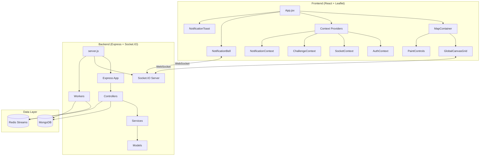

# PixelMap - Nền Tảng Pixel Art Thời Gian Thực

PixelMap là nền tảng nghệ thuật pixel cộng tác thời gian thực lấy cảm hứng từ r/place. Dự án cho phép cộng đồng cùng kiến tạo trên một canvas chia sẻ quy mô lớn, phối hợp chiến thuật cùng đội nhóm, chinh phục các thử thách hàng ngày và cạnh tranh trên bảng xếp hạng toàn cầu.

---

## 🎯 Tầm Nhìn & Mục Tiêu

### Tầm Nhìn Sản Phẩm
Xây dựng một không gian sáng tạo cộng đồng, nơi người dùng có thể **sáng tạo, cạnh tranh và thể hiện bản thân** trên một canvas toàn cầu. Nền tảng game hóa (gamify) quá trình vẽ tranh thông qua động lực đội nhóm, các thử thách hàng ngày (daily challenges) và hệ thống xếp hạng cạnh tranh.

### Điểm Nhấn Kỹ Thuật
- **Real-time Collaboration**: Đồng bộ pixel với độ trễ dưới 1 giây (sub-second latency) trên tất cả client qua WebSockets.
- **Canvas Hiệu Năng Cao**: Hỗ trợ lưới pixel 25,000 x 52,000+ (mô phỏng bản đồ thế giới).
- **High Availability**: Sử dụng Redis Caching với kỹ thuật tải dữ liệu theo khối (chunk-based loading) để tối ưu tốc độ.
- **Gamification Engine**: Hệ thống thử thách, chuỗi ngày (streaks), huy hiệu và cơ chế trả thưởng tự động.
- **Monetization Ready**: Tích hợp Stripe cho mua vật phẩm trong ứng dụng (tiền tệ droplets, vật phẩm năng lượng).
- **Event-Driven Architecture**: Kiến trúc hướng sự kiện sử dụng Redis Streams với cơ chế phân phối Hybrid Push/Pull.

### Đối Tượng Sử Dụng
- **Cộng đồng Pixel Art:** Những người tìm kiếm không gian sáng tạo chung.
- **Cộng đồng Game thủ:** Các nhóm muốn cạnh tranh chiếm lĩnh lãnh thổ.
- **Nhà tổ chức sự kiện:** Cần công cụ tương tác trực tiếp (interactive engagement) với khán giả.
- **Content Creators:** Xây dựng hoạt động cộng đồng thông qua nghệ thuật tập thể.

---

## 🏗 Kiến Trúc & Công Nghệ

### Frontend
| Công Nghệ | Phiên Bản | Mục Đích |
|-----------|-----------|----------|
| **React** | 19.x | Framework UI với hooks |
| **Vite** | 7.x | Công cụ build và dev server |
| **Leaflet / React-Leaflet** | 1.9.x / 5.x | Canvas tương tác dựa trên bản đồ |
| **Socket.IO Client** | 4.8.x | Giao tiếp hai chiều theo thời gian thực |
| **Stripe React** | 5.4.x | Tích hợp luồng thanh toán |
| **Axios** | 1.13.x | HTTP client |

### Backend
| Công Nghệ | Phiên Bản | Mục Đích |
|-----------|-----------|----------|
| **Express** | 5.x | Web framework |
| **Socket.IO** | 4.8.x | Phát sóng sự kiện theo thời gian thực |
| **Mongoose** | 8.x | MongoDB ODM |
| **Prisma** | 6.x | Database ORM (MongoDB provider) |
| **ioredis** | 5.8.x | Redis client cho caching |
| **Stripe** | 20.x | Xử lý thanh toán |
| **bcryptjs** | 3.x | Mã hóa mật khẩu |
| **jsonwebtoken** | 9.x | Xác thực JWT |
| **Nodemailer** | 7.x | Dịch vụ email |

### Database/Storage
| Hệ Thống | Mục Đích |
|----------|----------|
| **MongoDB** | Lưu trữ dữ liệu chính (users, pixels, teams, challenges, notifications) |
| **Redis** | Lớp caching cho chunk data + Streams cho xử lý sự kiện |

### Redis Streams
| Stream | Consumer Group | Mục Đích |
|--------|----------------|----------|
| `pixels:events` | `pixel-processors` | Xử lý sự kiện pixel |
| `notifications:events` | `notification-processors` | Phân phối thông báo (push/pull) |

### Các Mẫu Thiết Kế Chính



- **Mẫu MVC**: Controllers xử lý requests, Models định nghĩa cấu trúc dữ liệu, Services chứa logic nghiệp vụ
- **Mẫu Context**: React contexts cho trạng thái toàn cục (Auth, Socket, Challenge, Wallet, Notification)
- **Mẫu Repository**: Mongoose models với static methods cho truy cập dữ liệu
- **Mẫu Observer**: Socket.IO cho phát sóng sự kiện theo thời gian thực
- **Mẫu Outbox**: Event sourcing cho pixel events và notifications (đảm bảo tính nhất quán)
- **Tải Dựa Trên Chunk**: Dữ liệu canvas được tải theo chunk 256x256 pixel để tối ưu hiệu suất
- **Redis Streams**: Xử lý sự kiện tách rời cho notifications với consumer groups

---

## 🚀 Tính Năng Chính

### 1. 🎨 Canvas Tương Tác Thời Gian Thực (Real-time Canvas)
- Hỗ trợ lưới pixel khổng lồ (25,000+ px chiều cao) mô phỏng bản đồ thế giới.
- Tích hợp Leaflet cho phép thao tác Panning/Zooming mượt mà không độ trễ.
- Sử dụng kỹ thuật Chunk-based Loading (tải dữ liệu theo phân mảnh) để xử lý lượng dữ liệu lớn mà không gây lag client.
- Truy xuất thông tin chủ sở hữu, đội nhóm và lịch sử đặt pixel (Timestamp) ngay trên bản đồ.

### 2. 👥 Hợp Tác Đội Nhóm (Clan System)
- Tạo hoặc tham gia đội nhóm (Clan) để phối hợp chiến lược chiếm đất.
- Tính năng tải ảnh "blueprint" trong suốt đè lên bản đồ, giúp các thành viên tô màu chính xác theo thiết kế chung.
- Theo dõi bảng xếp hạng nội bộ và thống kê mức độ đóng góp lãnh thổ của từng thành viên.
- Hệ thống chat nội bộ và ping vị trí chiến thuật trực tiếp trên Canvas.

### 3. 🏆 Gamification Engine (Cơ Chế Game Hóa)
- Hệ thống nhiệm vụ luân phiên hàng ngày (Vd: Đặt 50 pixel màu đỏ, vẽ tại tọa độ X,Y).
- Cơ chế thưởng "Chuỗi ngày" (Streaks) để khuyến khích người dùng đăng nhập liên tục.
- Mở khóa Huy hiệu (Badges) và quy đổi điểm thưởng thành tích sang tiền tệ game (Droplets).

### 4. 💰 Kinh Tế & Monetization (Economy)
- Giới hạn số lượng pixel đặt theo thời gian thực thông qua cơ chế Năng lượng (Stamina) để cân bằng game.
- Kiếm tiền tệ ảo (Droplets) thông qua các hoạt động và thử thách trong game.
- Tích hợp cổng thanh toán Stripe để mua vật phẩm, gói hồi năng lượng và mở rộng sức chứa ví.
- Cửa hàng vật phẩm cho phép mua các gói Boost và nâng cấp tài khoản.

### 5. 📊 Analytics & Leaderboard
- Xếp hạng người dùng toàn cầu theo thời gian thực dựa trên tổng số pixel đã đặt.
- Phân tích dữ liệu người dùng theo các khung thời gian: Hàng ngày, Hàng tuần và Toàn thời gian.
- Trực quan hóa các khu vực hoạt động sôi nổi nhất trên bản đồ bằng biểu đồ nhiệt (Heatmap).

### 6. 🔔 Hệ Thống Thông Báo Hybrid (Push/Pull)
- Thông báo tức thì (Toast notification) qua Socket.IO cho các sự kiện quan trọng như nạp tiền thành công hay nhận thưởng.
- Sử dụng cơ chế "kéo" dữ liệu thụ động cho các thông báo cộng đồng để giảm tải cho server.
- Giao diện trung tâm thông báo tích hợp biểu tượng chuông, huy hiệu đếm số lượng chưa đọc và lịch sử hoạt động.

| Loại Sự Kiện | Phương Thức | Nguồn Kích Hoạt |
|---|---|---|
| `droplets_earned` | **Push** (Toast) | Người dùng hoàn thành thử thách hoặc nhận thưởng |
| `droplets_spent` | **Push** (Toast) | Xác nhận giao dịch mua hàng tại cửa hàng |
| `payment_success` | **Push** (Toast) | Webhook Stripe xác nhận thanh toán thành công |
| `team_member_joined` | **Pull** (Bell) | Có thành viên mới gia nhập đội |
| `team_member_left` | **Pull** (Bell) | Thành viên rời khỏi đội |
| `challenge_completed` | **Pull** (Bell) | Hoàn thành thử thách hàng ngày |
| `badge_earned` | **Pull** (Bell) | Mở khóa thành tích mới |

### 7. 🔐 Xác Thực & Quản Trị (Auth & Admin)
- Hỗ trợ đăng nhập đa phương thức bao gồm Email/Mật khẩu truyền thống và Google OAuth.
- Tích hợp quy trình xác thực email (Email Verification) và luồng khôi phục mật khẩu an toàn.
- Cung cấp bảng điều khiển CMS cho quản trị viên để giám sát người dùng và xử lý vi phạm.
- Hệ thống gửi phiếu kháng nghị (Appeal Ticket) tự động dành cho các tài khoản bị hạn chế.

---

## 🛠 Cài Đặt & Triển Khai

### Yêu Cầu Hệ Thống (Prerequisites)
- Node.js phiên bản 18 trở lên.
- MongoDB (Khuyên dùng MongoDB Atlas hoặc chạy qua Docker).
- Redis (Yêu cầu phiên bản hỗ trợ Redis Streams).
- Tài khoản Stripe Developer (cần thiết để kiểm thử tính năng thanh toán).

### Thiết Lập Môi Trường Dev (Quick Start)
```bash
# Clone repository
git clone <repo-url>
cd map-server

# --- Thiết Lập Backend ---
cd backend
cp .env.local .env
# Chỉnh sửa .env với MongoDB URI, cấu hình Redis và khóa Stripe của bạn
npm install
npm run prisma:generate
npm run dev

# --- Thiết Lập Frontend (terminal mới) ---
cd frontend
cp .env.example .env  # Cấu hình VITE_API_URL nếu cần
npm install
npm run dev
```

### Biến Môi Trường (Backend `.env`)

```env
# Database
MONGO_URI=mongodb://localhost:27017/pixelmap
DATABASE_URL=mongodb://localhost:27017/pixelmap

# Redis
REDIS_HOST=localhost
REDIS_PORT=6379

# Server
PORT=4000
SESSION_SECRET=your-session-secret

# Auth
GOOGLE_CLIENT_ID=your-google-client-id

# Email
EMAIL_USERNAME=your-email@gmail.com
EMAIL_PASSWORD=your-app-password

# Payments
STRIPE_SECRET_KEY=sk_test_...
STRIPE_WEBHOOK_SECRET=whsec_...

# Security
RECAPTCHA_V2_SECRET_KEY=your-recaptcha-key
```

### Các Lệnh Có Sẵn

#### Backend (`/map-server/backend`)
| Lệnh | Mô Tả |
|------|-------|
| `npm run dev` | Khởi chạy server môi trường Development (Hot-reload) |
| `npm start` | Khởi chạy server môi trường Production |
| `npm run prisma:generate` | Tạo Prisma Client artifacts |
| `npm run prisma:push` | Đồng bộ nhanh Schema lên Database (Prototyping) |
| `npm run prisma:studio` | Mở giao diện quản lý dữ liệu Prisma Studio |
| `npm run migrate:up` | Thực thi các migration MongoDB |

#### Frontend (`/map-server/frontend`)
| Lệnh | Mô Tả |
|------|-------|
| `npm run dev` | Khởi chạy Vite Dev Server |
| `npm run build` | Build ứng dụng cho Production |
| `npm run preview` | Chạy thử bản build production trên local |
| `npm run lint` | Kiểm tra lỗi cú pháp (Linting) |

### Triển Khai Docker

```bash
# Development với Docker Compose
docker-compose up -d

# Production
docker-compose -f docker-compose.prod.yml up -d

---

## 📁 Cấu Trúc Dự Án

```text
map-server/
├── backend/
│   ├── src/
│   │   ├── config/          # Cấu hình hệ thống (Redis, DB, Env)
│   │   │   └── redis.js     # Redis client + Stream constants
│   │   ├── controllers/     # Xử lý HTTP Request
│   │   │   ├── authController.js
│   │   │   ├── pixelController.js
│   │   │   ├── teamController.js
│   │   │   └── notificationController.js  # CRUD thông báo
│   │   ├── middleware/      # Middleware (Auth, Validation)
│   │   ├── models/          # Định nghĩa Schema
│   │   │   ├── User.js
│   │   │   ├── Pixel.js
│   │   │   ├── Team.js
│   │   │   ├── Notification.js   # Schema thông báo
│   │   │   └── Outbox.js         # Event outbox pattern
│   │   ├── routes/          # Định tuyến API
│   │   │   └── notificationRoutes.js
│   │   ├── services/        # Logic nghiệp vụ (Business Logic)
│   │   │   ├── challengeService.js
│   │   │   ├── walletService.js
│   │   │   ├── paymentService.js
│   │   │   └── notificationService.js
│   │   ├── socket/          # Xử lý sự kiện Socket.IO
│   │   ├── utils/           # Các hàm tiện ích (Helpers)
│   │   ├── workers/         # Xử lý tác vụ nền (Background Jobs)
│   │       ├── outboxPublisher.js     # Outbox -> Redis Stream
│   │       ├── streamConsumer.js      # Xử lý pixel event
│   │       └── notificationConsumer.js # Xử lý phân phối thông báo
│   ├── prisma/              # Prisma schema & Config
│   └── server.js            # Entry point & Worker init
│
├── frontend/
│   ├── src/
│   │   ├── components/
│   │   │   ├── NotificationBell.jsx   # UI chuông & Dropdown
│   │   │   ├── NotificationToast.jsx  # UI Toast Pop-ups
│   │   │   └── Notification.css       # Styles
│   │   ├── context/         # Global State Management
│   │   │   ├── AuthContext.jsx
│   │   │   ├── SocketContext.jsx
│   │   │   ├── ChallengeContext.jsx
│   │   │   └── NotificationContext.jsx
│   │   ├── services/        # API Integration
│   │   │   └── notificationApi.js
│   │   ├── config/          # Hằng số hệ thống
│   │   ├── App.jsx          # Main App Component
│   │   └── main.jsx         # Entry point
│   └── index.html
│
└── docker-compose.yml       # Docker Orchestration
```
---

## 🔌 Tổng Quan API

| Endpoint | Method | Chức Năng Chính |
|----------|--------|-----------------|
| `/api/auth/*` | Mixed | Quản lý xác thực & Phiên làm việc (Login, Register, OAuth) |
| `/api/pixels/*` | GET/POST | Truy xuất dữ liệu bản đồ & Thao tác đặt Pixel |
| `/api/teams/*` | Mixed | Quản lý Đội nhóm (Tạo, tham gia, rời đội) |
| `/api/challenges/*` | GET/POST | Hệ thống nhiệm vụ hàng ngày & Cơ chế trả thưởng |
| `/api/wallet/*` | GET/POST | Quản lý số dư Droplets & Lịch sử giao dịch |
| `/api/store/*` | GET/POST | Danh mục vật phẩm & Xử lý mua hàng (Inventory) |
| `/api/payment/*` | POST | Xử lý thanh toán nạp tiền (Stripe Intent) |
| `/api/leaderboard/*` | GET | Truy xuất Bảng xếp hạng & Thống kê Global |
| `/api/notifications/*` | Mixed | Quản lý thông báo & Trạng thái đọc |
| `/api/admin/*` | Mixed | Các tác vụ quản trị hệ thống (Protected Route) |

---

## 🌐 Triển Khai Trực Tiếp

- **URL Production**: `https://se2025-17-3.codes`
- **Cơ sở hạ tầng**: Docker containers với nginx reverse proxy
- **SSL**: Chứng chỉ Let's Encrypt

---

## 📝 Giấy Phép

ISC License
