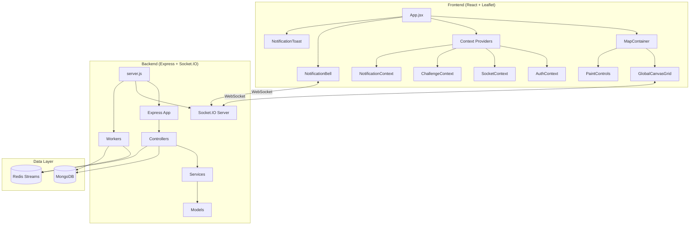
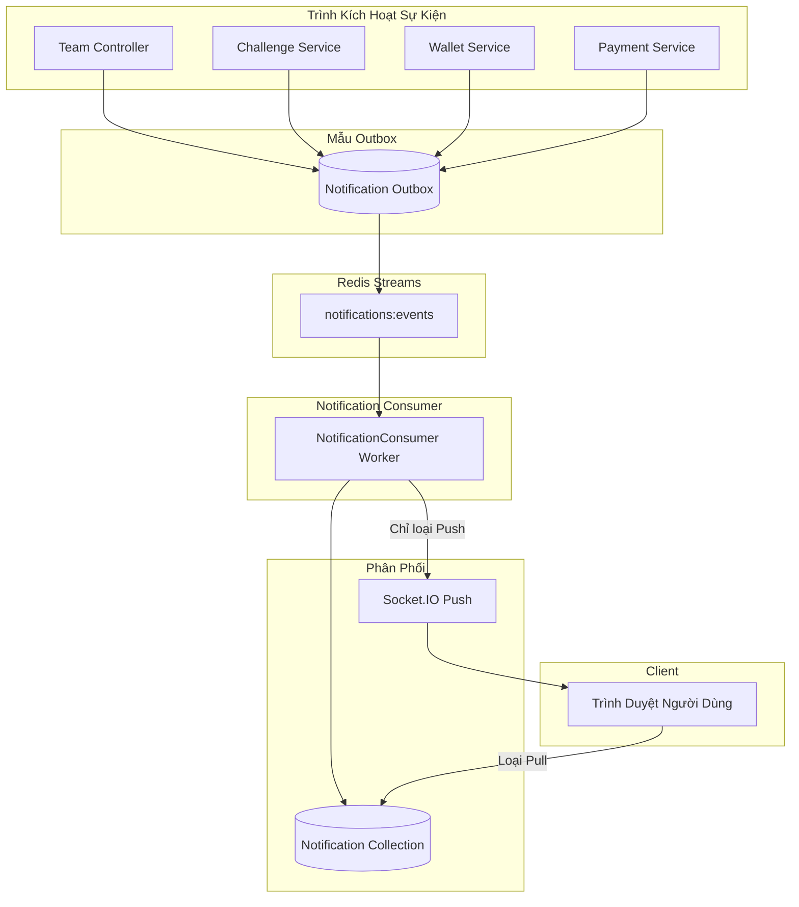

# PixelMap - Nền Tảng Vẽ Pixel Cộng Tác

Một nền tảng nghệ thuật pixel cộng tác theo thời gian thực lấy cảm hứng từ r/place của Reddit, cho phép người dùng đặt các pixel màu trên một canvas chia sẻ khổng lồ, phối hợp với các đội nhóm, hoàn thành thử thách hàng ngày và cạnh tranh trên bảng xếp hạng toàn cầu.

---

## 🎯 Mục Tiêu

### Mục Tiêu Kinh Doanh Chính
**Cung cấp trải nghiệm nghệ thuật pixel cộng tác nơi cộng đồng có thể sáng tạo, cạnh tranh và thể hiện bản thân một cách tập thể trên một canvas toàn cầu được chia sẻ.** Nền tảng này game hóa quá trình sáng tạo thông qua động lực đội nhóm, thử thách hàng ngày và bảng xếp hạng cạnh tranh.

### Mục Tiêu Kỹ Thuật
- **Cộng tác theo thời gian thực**: Cập nhật pixel dưới một giây trên tất cả các client được kết nối qua WebSockets
- **Canvas quy mô lớn**: Hỗ trợ lưới pixel 25,000 x 52,000+ (phép chiếu bản đồ thế giới)
- **Tính khả dụng cao**: Bộ nhớ đệm Redis với tải dữ liệu dựa trên chunk để tối ưu hiệu suất
- **Công cụ game hóa**: Hệ thống thử thách với chuỗi ngày, huy hiệu và cơ chế phần thưởng
- **Sẵn sàng kiếm tiền**: Tích hợp Stripe cho mua hàng trong ứng dụng (tiền tệ droplets, tăng năng lượng)
- **Thông báo hướng sự kiện**: Redis Streams với phân phối đẩy/kéo kết hợp để tương tác người dùng

### Đối Tượng Mục Tiêu
- **Cộng đồng nghệ thuật pixel** tìm kiếm không gian sáng tạo cộng tác
- **Cộng đồng game** muốn cạnh tranh đội nhóm dựa trên lãnh thổ
- **Nhà tổ chức sự kiện** tìm kiếm sự tham gia tương tác của khán giả
- **Nhà sáng tạo nội dung** xây dựng sự tương tác cộng đồng thông qua nghệ thuật tập thể

---

## 🏗 Kiến Trúc & Công Nghệ

### Frontend
| Công Nghệ | Phiên Bản | Mục Đích |
|-----------|-----------|----------|
| **React** | 19.x | Framework UI với hooks |
| **Vite** | 7.x | Công cụ build và dev server |
| **Leaflet / React-Leaflet** | 1.9.x / 5.x | Canvas tương tác dựa trên bản đồ |
| **Socket.IO Client** | 4.8.x | Giao tiếp hai chiều theo thời gian thực |
| **Stripe React** | 5.4.x | Tích hợp luồng thanh toán |
| **Axios** | 1.13.x | HTTP client |

### Backend
| Công Nghệ | Phiên Bản | Mục Đích |
|-----------|-----------|----------|
| **Express** | 5.x | Web framework |
| **Socket.IO** | 4.8.x | Phát sóng sự kiện theo thời gian thực |
| **Mongoose** | 8.x | MongoDB ODM |
| **Prisma** | 6.x | Database ORM (MongoDB provider) |
| **ioredis** | 5.8.x | Redis client cho caching |
| **Stripe** | 20.x | Xử lý thanh toán |
| **bcryptjs** | 3.x | Mã hóa mật khẩu |
| **jsonwebtoken** | 9.x | Xác thực JWT |
| **Nodemailer** | 7.x | Dịch vụ email |

### Database/Storage
| Hệ Thống | Mục Đích |
|----------|----------|
| **MongoDB** | Lưu trữ dữ liệu chính (users, pixels, teams, challenges, notifications) |
| **Redis** | Lớp caching cho chunk data + Streams cho xử lý sự kiện |

### Redis Streams
| Stream | Consumer Group | Mục Đích |
|--------|----------------|----------|
| `pixels:events` | `pixel-processors` | Xử lý sự kiện pixel |
| `notifications:events` | `notification-processors` | Phân phối thông báo (push/pull) |

### Các Mẫu Thiết Kế Chính



- **Mẫu MVC**: Controllers xử lý requests, Models định nghĩa cấu trúc dữ liệu, Services chứa logic nghiệp vụ
- **Mẫu Context**: React contexts cho trạng thái toàn cục (Auth, Socket, Challenge, Wallet, Notification)
- **Mẫu Repository**: Mongoose models với static methods cho truy cập dữ liệu
- **Mẫu Observer**: Socket.IO cho phát sóng sự kiện theo thời gian thực
- **Mẫu Outbox**: Event sourcing cho pixel events và notifications (đảm bảo tính nhất quán)
- **Tải Dựa Trên Chunk**: Dữ liệu canvas được tải theo chunk 256x256 pixel để tối ưu hiệu suất
- **Redis Streams**: Xử lý sự kiện tách rời cho notifications với consumer groups

### Kiến Trúc Hệ Thống Thông Báo



---

## 🚀 Tính Năng Chính

### 1. 🎨 Canvas Pixel Thời Gian Thực
- Đặt các pixel màu trên canvas toàn cầu khổng lồ (độ phân giải chiều cao 25,000+)
- Bản đồ dựa trên Leaflet với panning/zooming mượt mà
- Tải dựa trên chunk để tối ưu hiệu suất ở quy mô lớn
- Thuộc tính pixel hiển thị chủ sở hữu, đội và dấu thời gian

### 2. 👥 Cộng Tác Đội Nhóm
- Tạo/tham gia đội để đặt pixel có phối hợp
- **Lớp phủ đội**: Tải lên hình ảnh mẫu để hướng dẫn tác phẩm nghệ thuật cộng tác
- Bảng xếp hạng dựa trên đội theo dõi đóng góp pixel tập thể
- Chat đội và hệ thống ping theo thời gian thực

### 3. 🏆 Thử Thách Hàng Ngày & Chuỗi Ngày
- Thử thách hàng ngày luân phiên (đặt X pixel, sử dụng màu cụ thể, v.v.)
- Hệ thống chuỗi ngày thưởng cho sự tham gia hàng ngày liên tiếp
- Điểm thử thách có thể chuyển đổi thành tiền tệ trong game (droplets)
- Hệ thống huy hiệu cho thành tích

### 4. 💰 Kinh Tế & Cửa Hàng
- **Hệ thống năng lượng**: Tài nguyên tái tạo cần thiết để đặt pixel
- **Droplets**: Tiền tệ trong game kiếm được thông qua thử thách
- **Thanh toán Stripe**: Mua tăng năng lượng và nâng cấp dung lượng
- Vật phẩm cửa hàng: Nâng cấp dung lượng tối đa, gói nạp năng lượng

### 5. 📊 Bảng Xếp Hạng & Thống Kê
- Xếp hạng người dùng toàn cầu theo số lượng pixel
- Bảng xếp hạng đội với phân tích thành viên
- Chế độ xem được lọc theo thời gian (hàng ngày, hàng tuần, mọi thời điểm)
- Trực quan hóa bản đồ nhiệt của hoạt động

### 6. 🔔 Hệ Thống Thông Báo
- **Thông báo đẩy theo thời gian thực** qua Socket.IO cho phản hồi tức thì
- **Thông báo dựa trên kéo** được lấy theo yêu cầu cho cập nhật thân thiện với batch
- Biểu tượng chuông với huy hiệu số lượng chưa đọc
- Toast pop-ups cho thông báo quan trọng (droplets kiếm được, thanh toán)
- Lịch sử thông báo với chức năng đánh dấu đã đọc

| Loại Thông Báo | Phân Phối | Trình Kích Hoạt |
|----------------|-----------|-----------------|
| `droplets_earned` | **Push** (Toast) | Hoàn thành thử thách, phần thưởng |
| `droplets_spent` | **Push** (Toast) | Mua hàng tại cửa hàng |
| `payment_success` | **Push** (Toast) | Thanh toán Stripe được xác nhận |
| `team_member_joined` | **Pull** (Bell) | Thành viên mới tham gia đội |
| `team_member_left` | **Pull** (Bell) | Thành viên rời đội |
| `challenge_completed` | **Pull** (Bell) | Thử thách hàng ngày hoàn thành |
| `badge_earned` | **Pull** (Bell) | Mở khóa thành tích |

### 7. 🔐 Xác Thực & Quản Trị
- Xác thực Email/mật khẩu + Google OAuth
- Luồng xác minh email và đặt lại mật khẩu
- Bảng điều khiển quản trị cho quản lý người dùng/cấm
- Hệ thống kháng nghị cho người dùng bị cấm

---

## 🛠 Cài Đặt & Thiết Lập

### Yêu Cầu Tiên Quyết
- Node.js 18+
- MongoDB instance (local hoặc Atlas)
- Redis instance (local hoặc cloud)
- Tài khoản Stripe (cho thanh toán)

### Khởi Động Nhanh (Development)

```bash
# Clone repository
git clone <repo-url>
cd map-server

# --- Thiết Lập Backend ---
cd backend
cp .env.local .env
# Chỉnh sửa .env với MongoDB URI, cấu hình Redis và khóa Stripe của bạn
npm install
npm run prisma:generate
npm run dev

# --- Thiết Lập Frontend (terminal mới) ---
cd frontend
cp .env.example .env  # Cấu hình VITE_API_URL nếu cần
npm install
npm run dev
```

### Biến Môi Trường (Backend `.env`)

```env
# Database
MONGO_URI=mongodb://localhost:27017/pixelmap
DATABASE_URL=mongodb://localhost:27017/pixelmap

# Redis
REDIS_HOST=localhost
REDIS_PORT=6379

# Server
PORT=4000
SESSION_SECRET=your-session-secret

# Auth
GOOGLE_CLIENT_ID=your-google-client-id

# Email
EMAIL_USERNAME=your-email@gmail.com
EMAIL_PASSWORD=your-app-password

# Payments
STRIPE_SECRET_KEY=sk_test_...
STRIPE_WEBHOOK_SECRET=whsec_...

# Security
RECAPTCHA_V2_SECRET_KEY=your-recaptcha-key
```

### Các Lệnh Có Sẵn

#### Backend (`/map-server/backend`)
| Lệnh | Mô Tả |
|------|-------|
| `npm run dev` | Khởi động dev server với hot reload |
| `npm start` | Khởi động production server |
| `npm run prisma:generate` | Tạo Prisma client |
| `npm run prisma:push` | Đẩy schema lên database |
| `npm run prisma:studio` | Mở Prisma Studio GUI |
| `npm run migrate:up` | Chạy MongoDB migrations |

#### Frontend (`/map-server/frontend`)
| Lệnh | Mô Tả |
|------|-------|
| `npm run dev` | Khởi động Vite dev server |
| `npm run build` | Build cho production |
| `npm run preview` | Xem trước production build |
| `npm run lint` | Chạy ESLint |

### Triển Khai Docker

```bash
# Development với Docker Compose
docker-compose up -d

# Production
docker-compose -f docker-compose.prod.yml up -d
```

---

## 📁 Cấu Trúc Dự Án

```
map-server/
├── backend/
│   ├── src/
│   │   ├── config/          # Cấu hình Redis, database
│   │   │   └── redis.js     # Redis client + hằng số Stream
│   │   ├── controllers/
│   │   │   ├── authController.js
│   │   │   ├── pixelController.js
│   │   │   ├── teamController.js
│   │   │   └── notificationController.js  # CRUD thông báo
│   │   ├── middleware/      # Auth, validation
│   │   ├── models/
│   │   │   ├── User.js
│   │   │   ├── Pixel.js
│   │   │   ├── Team.js
│   │   │   ├── Notification.js   # Schema thông báo
│   │   │   └── Outbox.js         # Event outbox
│   │   ├── routes/
│   │   │   └── notificationRoutes.js  # /api/notifications
│   │   ├── services/
│   │   │   ├── challengeService.js    # Kích hoạt thông báo
│   │   │   ├── walletService.js       # Kích hoạt thông báo
│   │   │   ├── paymentService.js      # Kích hoạt thông báo
│   │   │   └── notificationService.js # Logic nghiệp vụ thông báo
│   │   ├── socket/          # Xử lý Socket.IO
│   │   ├── utils/           # Hàm helper
│   │   └── workers/
│   │       ├── outboxPublisher.js     # Outbox → Redis Stream
│   │       ├── streamConsumer.js      # Pixel event consumer
│   │       └── notificationConsumer.js # Notification consumer
│   ├── prisma/              # Prisma schema
│   ├── migrations/          # MongoDB migrations
│   └── server.js            # Entry point + khởi động worker
│
├── frontend/
│   ├── src/
│   │   ├── components/
│   │   │   ├── NotificationBell.jsx   # Biểu tượng chuông + dropdown
│   │   │   ├── NotificationToast.jsx  # Toast pop-ups
│   │   │   └── Notification.css       # Styles thông báo
│   │   ├── context/
│   │   │   ├── AuthContext.jsx
│   │   │   ├── SocketContext.jsx
│   │   │   ├── ChallengeContext.jsx
│   │   │   └── NotificationContext.jsx # Trạng thái thông báo
│   │   ├── services/
│   │   │   └── notificationApi.js     # API calls thông báo
│   │   ├── config/          # Hằng số, cấu hình
│   │   ├── App.jsx          # Ứng dụng chính
│   │   └── main.jsx         # Entry point + providers
│   └── index.html
│
└── docker-compose.yml       # Điều phối Docker
```

---

## 🔌 Tổng Quan API

| Endpoint | Method | Mô Tả |
|----------|--------|-------|
| `/api/auth/*` | Nhiều | Xác thực (login, register, OAuth) |
| `/api/pixels/*` | GET/POST | Dữ liệu pixel và đặt pixel |
| `/api/teams/*` | Nhiều | CRUD và quản lý đội |
| `/api/challenges/*` | GET/POST | Thử thách hàng ngày và phần thưởng |
| `/api/wallet/*` | GET/POST | Số dư droplets và giao dịch |
| `/api/store/*` | GET/POST | Vật phẩm cửa hàng và mua hàng |
| `/api/payment/*` | POST | Payment intents Stripe |
| `/api/leaderboard/*` | GET | Xếp hạng và thống kê |
| `/api/notifications/*` | Nhiều | Thông báo người dùng |
| `/api/admin/*` | Nhiều | Thao tác quản trị (được bảo vệ) |

### Các Endpoint API Thông Báo

| Endpoint | Method | Mô Tả |
|----------|--------|-------|
| `/api/notifications` | GET | Liệt kê thông báo của người dùng (phân trang) |
| `/api/notifications/unread-count` | GET | Lấy số lượng thông báo chưa đọc |
| `/api/notifications/:id/read` | PATCH | Đánh dấu thông báo đơn lẻ đã đọc |
| `/api/notifications/read-all` | PATCH | Đánh dấu tất cả thông báo đã đọc |

---

## 🌐 Triển Khai Trực Tiếp

- **URL Production**: `https://se2025-17-3.codes`
- **Cơ sở hạ tầng**: Docker containers với nginx reverse proxy
- **SSL**: Chứng chỉ Let's Encrypt

---

## 📝 Giấy Phép

ISC License
