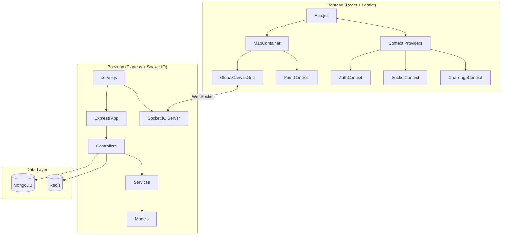

# PixelMap - Collaborative Pixel Canvas Platform

A real-time collaborative pixel art platform inspired by Reddit's r/place, allowing users to place colored pixels on a massive shared canvas, coordinate with teams, complete daily challenges, and compete on global leaderboards.

---

## 🎯 Goals & Objectives

### Primary Business Goal
**To provide a collaborative pixel art experience where communities can create, compete, and express themselves collectively on a shared global canvas.** This platform gamifies the creative process through team dynamics, daily challenges, and competitive leaderboards.

### Technical Objectives
- **Real-time collaboration**: Sub-second pixel updates across all connected clients via WebSockets
- **Massive scale canvas**: Support for 25,000 x 52,000+ pixel grid (world-map projection)
- **High availability**: Redis caching with chunk-based data loading for performance
- **Gamification engine**: Challenge system with streaks, badges, and reward mechanics
- **Monetization ready**: Stripe integration for in-app purchases (droplets currency, energy boosts)

### Target Audience
- **Pixel art communities** seeking collaborative creation spaces
- **Gaming communities** wanting territory-based team competition
- **Event organizers** looking for interactive audience participation
- **Content creators** building community engagement through collective art

---

## 🏗 Architecture & Stack

### Frontend
| Technology | Version | Purpose |
|------------|---------|---------|
| **React** | 19.x | UI framework with hooks |
| **Vite** | 7.x | Build tool and dev server |
| **Leaflet / React-Leaflet** | 1.9.x / 5.x | Interactive map-based canvas |
| **Socket.IO Client** | 4.8.x | Real-time bidirectional communication |
| **Stripe React** | 5.4.x | Payment flow integration |
| **Axios** | 1.13.x | HTTP client |

### Backend
| Technology | Version | Purpose |
|------------|---------|---------|
| **Express** | 5.x | Web framework |
| **Socket.IO** | 4.8.x | Real-time event broadcasting |
| **Mongoose** | 8.x | MongoDB ODM |
| **Prisma** | 6.x | Database ORM (MongoDB provider) |
| **ioredis** | 5.8.x | Redis client for caching |
| **Stripe** | 20.x | Payment processing |
| **bcryptjs** | 3.x | Password hashing |
| **jsonwebtoken** | 9.x | JWT authentication |
| **Nodemailer** | 7.x | Email services |

### Database/Storage
| System | Purpose |
|--------|---------|
| **MongoDB** | Primary data store (users, pixels, teams, challenges) |
| **Redis** | Caching layer for chunk data + Pub/Sub for real-time events |

### Key Design Patterns



- **MVC Pattern**: Controllers handle requests, Models define data structures, Services contain business logic
- **Context Pattern**: React contexts for global state (Auth, Socket, Challenge, Wallet)
- **Repository Pattern**: Mongoose models with static methods for data access
- **Observer Pattern**: Socket.IO for real-time event broadcasting
- **Outbox Pattern**: Event sourcing for pixel events (ensures consistency)
- **Chunk-based Loading**: Canvas data loaded in 256x256 pixel chunks for performance

---

## 🚀 Key Features

### 1. 🎨 Real-time Pixel Canvas
- Place colored pixels on a massive global canvas (25,000+ height resolution)
- Leaflet-based map with smooth panning/zooming
- Chunk-based loading for performance at scale
- Pixel attribution showing owner, team, and timestamp

### 2. 👥 Team Collaboration
- Create/join teams for coordinated pixel placement
- **Team overlays**: Upload template images to guide collaborative artwork
- Team-based leaderboards tracking collective pixel contribution
- Real-time team chat and ping system

### 3. 🏆 Daily Challenges & Streaks
- Rotating daily challenges (place X pixels, use specific colors, etc.)
- Streak system rewarding consecutive daily participation
- Challenge points convertible to in-game currency (droplets)
- Badge system for achievements

### 4. 💰 Economy & Store
- **Energy system**: Regenerating resource required to place pixels
- **Droplets**: In-game currency earned through challenges
- **Stripe payments**: Purchase energy boosts and capacity upgrades
- Store items: Max capacity upgrades, energy recharge packs

### 5. 📊 Leaderboards & Stats
- Global user rankings by pixel count
- Team leaderboards with member breakdowns
- Time-filtered views (daily, weekly, all-time)
- Heatmap visualization of activity

### 6. 🔐 Authentication & Admin
- Email/password + Google OAuth authentication
- Email verification and password reset flows
- Admin dashboard for user/ban management
- Appeal system for banned users

---

## 🛠 Setup & Installation

### Prerequisites
- Node.js 18+
- MongoDB instance (local or Atlas)
- Redis instance (local or cloud)
- Stripe account (for payments)

### Quick Start (Development)

```bash
# Clone the repository
git clone <repo-url>
cd map-server

# --- Backend Setup ---
cd backend
cp .env.local .env
# Edit .env with your MongoDB URI, Redis config, and Stripe keys
npm install
npm run prisma:generate
npm run dev

# --- Frontend Setup (new terminal) ---
cd frontend
cp .env.example .env  # Configure VITE_API_URL if needed
npm install
npm run dev
```

### Environment Variables (Backend `.env`)

```env
# Database
MONGO_URI=mongodb://localhost:27017/pixelmap
DATABASE_URL=mongodb://localhost:27017/pixelmap

# Redis
REDIS_HOST=localhost
REDIS_PORT=6379

# Server
PORT=4000
SESSION_SECRET=your-session-secret

# Auth
GOOGLE_CLIENT_ID=your-google-client-id

# Email
EMAIL_USERNAME=your-email@gmail.com
EMAIL_PASSWORD=your-app-password

# Payments
STRIPE_SECRET_KEY=sk_test_...
STRIPE_WEBHOOK_SECRET=whsec_...

# Security
RECAPTCHA_V2_SECRET_KEY=your-recaptcha-key
```

### Available Scripts

#### Backend (`/map-server/backend`)
| Command | Description |
|---------|-------------|
| `npm run dev` | Start dev server with hot reload |
| `npm start` | Start production server |
| `npm run prisma:generate` | Generate Prisma client |
| `npm run prisma:push` | Push schema to database |
| `npm run prisma:studio` | Open Prisma Studio GUI |
| `npm run migrate:up` | Run MongoDB migrations |

#### Frontend (`/map-server/frontend`)
| Command | Description |
|---------|-------------|
| `npm run dev` | Start Vite dev server |
| `npm run build` | Build for production |
| `npm run preview` | Preview production build |
| `npm run lint` | Run ESLint |

### Docker Deployment

```bash
# Development with Docker Compose
docker-compose up -d

# Production
docker-compose -f docker-compose.prod.yml up -d
```

---

## 📁 Project Structure

```
map-server/
├── backend/
│   ├── src/
│   │   ├── config/          # Redis, database configs
│   │   ├── controllers/     # Request handlers
│   │   ├── middleware/      # Auth, validation
│   │   ├── models/          # Mongoose schemas
│   │   ├── routes/          # API route definitions
│   │   ├── services/        # Business logic
│   │   ├── socket/          # Socket.IO handlers
│   │   ├── utils/           # Helper functions
│   │   └── workers/         # Background jobs
│   ├── prisma/              # Prisma schema
│   ├── migrations/          # MongoDB migrations
│   └── server.js            # Entry point
│
├── frontend/
│   ├── src/
│   │   ├── components/      # React components
│   │   ├── context/         # React contexts
│   │   ├── services/        # API service layer
│   │   ├── config/          # Constants, configuration
│   │   ├── App.jsx          # Main application
│   │   └── main.jsx         # Entry point
│   └── index.html
│
└── docker-compose.yml       # Docker orchestration
```

---

## 🔌 API Overview

| Endpoint | Method | Description |
|----------|--------|-------------|
| `/api/auth/*` | Various | Authentication (login, register, OAuth) |
| `/api/pixels/*` | GET/POST | Pixel data and placement |
| `/api/teams/*` | Various | Team CRUD and management |
| `/api/challenges/*` | GET/POST | Daily challenges and rewards |
| `/api/wallet/*` | GET/POST | Droplets balance and transactions |
| `/api/store/*` | GET/POST | Store items and purchases |
| `/api/payment/*` | POST | Stripe payment intents |
| `/api/leaderboard/*` | GET | Rankings and stats |
| `/api/admin/*` | Various | Admin operations (protected) |

---

## 🌐 Live Deployment

- **Production URL**: `https://se2025-17-3.codes`
- **Infrastructure**: Docker containers with nginx reverse proxy
- **SSL**: Let's Encrypt certificates

---

## 📝 License

ISC License
